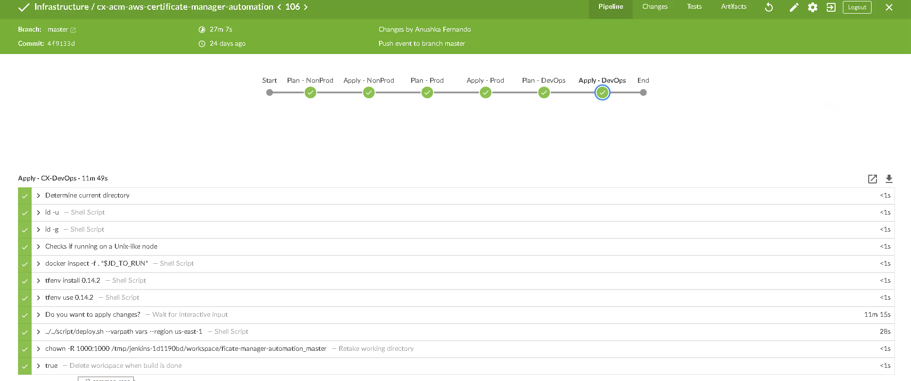
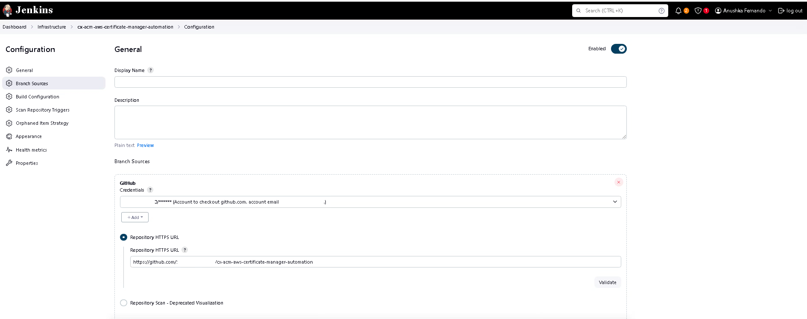
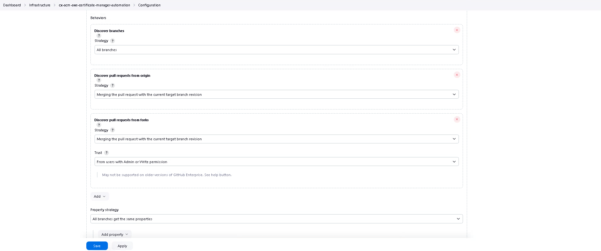
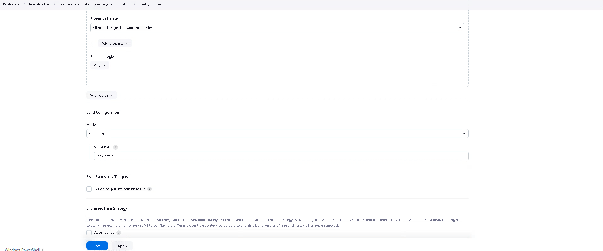
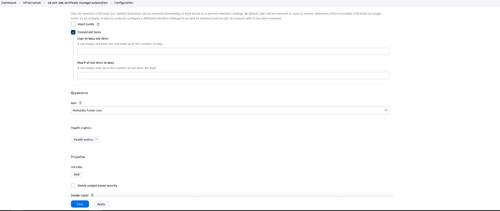
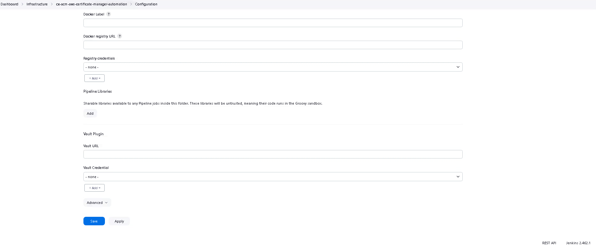

# aws-certificate-manager-automation

This repo manages all the ACM SSL Certificates

✨[Jenkins Job URL](http://jenkins.net/job/Infrastructure/job/acm-aws-certificate-manager-automation/) ✨

# Prerequisites
Ensure the domain name created falls under the ACM domain_name character limit of 64 characters.

# Screeshots

